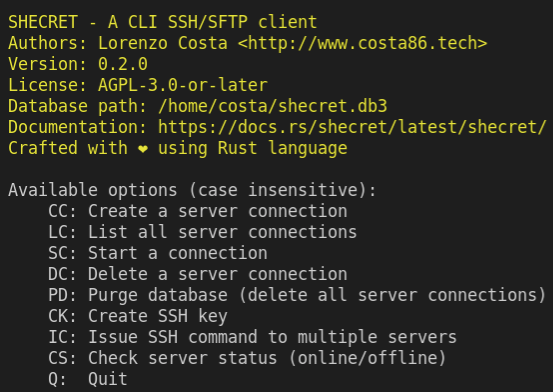

# Schecret

## Description

Shecret is a CLI SSH/SFTP client

## Usage

    ./shecret

Once the connection is selected, the full SSH/SFTP command will be stored on your clipboard, then just paste it on the terminal!

## Features

## Demo

## Executable

|Linux | Windows|
|--|--|
|[shecret](./shecret)|-|

